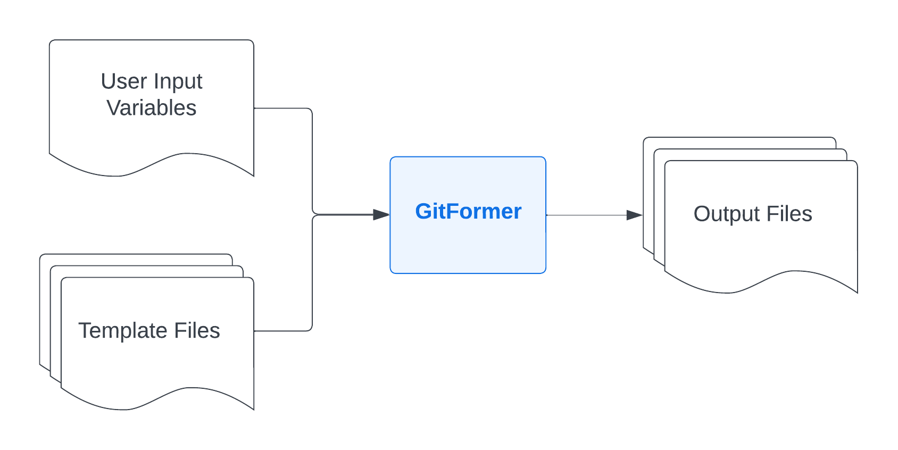

# GitFormer

GitFormer is a tool to generate code from templates and user input. 

## Demo


## Use Cases

GitFormer can be useful anytime code needs to be generated with a few minor modifications, 
such as with the Configuration as Code / Infrastructure as Code tools listed below. 
While these tools have some built-in support for variables and resuable code modules, 
developers still end up copying and pasting code when creating similar resources. GitFormer 
helps automate these repetitive code changes by collecting user input and generating code 
from templates.

- Terraform
- Ansible
- Chef
- Puppet
- Salt
- AWS CloudFormation
- Azure Resource Manager
- GCP Cloud Deployment Manager

GitFormer is not limited to any specific technology and can be used with custom file formats. 

<p align="center" width="100%">
    
</p>

## Installing

Install the latest version of Gitformer from the list of [Releases](https://github.com/peachpielabs/gitformer/releases).

```bash
wget <RELEASE_URL>
tar -zxvf <downloaded_tarfile>
chmod +x gitformer
mv gitformer /usr/local/bin/
```

Since the binary is currently unsigned, on MacOS you will need to `right click > open` the file in Finder to bypass the security warning.

Confirm you're able to execute the version subcommand:
```bash
gitformer --version
```

## Getting Started

1. Define a template file using Go templating syntax.  In this example, we'll use the file at `examples/terraform_new_zone_record/zone_record.tpl`

```hcl
resource "dnsimple_zone_record" "dns_record_{{.subdomain_name}}" {
  zone_name = "${var.dnsimple_domain}"
  name   = "{{.subdomain_name}}"
  value  = "{{.record_value}}"
  type   = "{{.record_type}}"
  ttl    = {{.ttl}}
}
```


2. Define your Playbook as a YAML configuration. We'll use the example file at `examples/terraform_new_zone_record/playbook.yaml`:

```yaml
name: New Zone Record
description: "Create a new DNS zone record using Terraform."
questions:
  - prompt: "Request subdomain under example.com"
    variablename: subdomain_name
    placeholder: yourdomain.example.com
    required: true
    inputtype: textfield
    variabletype: string
  - prompt: "DNS record type"
    inputtype: select
    variablename: record_type
    required: true
    variabletype: string
    validvalues:
      - A
      - CNAME
    default: A
  - prompt: "DNS Value (IP Address for A records or fully qualified domain name for CNAME records)"
    variablename: record_value
    inputtype: textfield
    required: true
    placeholder: "192.168.1.1"
    variabletype: string
  - prompt: "TTL (Time to Live)"
    variablename: ttl
    inputtype: textfield
    required: true
    variabletype: int
    default: "3600"
outputs:
  - templatefile: zone_record.tpl
    outputfile: terraform/{{.subdomain_name}}.tf
```

2. Run the following command to execute your playbook. This will launch an interactive prompt to collect input. 

```bash
gitformer run examples/terraform_new_zone_record/playbook.yaml
```

In this example, we'll provide the following answers to the prompts:

- Request subdomain under example.com: **www**
- DNS record type: **A**
- IP Address: **10.0.0.1**
- TTL: **300** 

Once all questions are answered, Gitformer will render the template file. If you used the answers above, the file will be rendered to `examples/terraform_new_zone_record/terraform/www.tf` with the following contents:

```
resource "dnsimple_zone_record" "dns_record_www" {
  zone_name = "${var.dnsimple_domain}"
  name   = "www"
  value  = "10.0.0.1"
  type   = "A"
  ttl    = 300
}
```

View the [Playbook Configuration Syntax](docs/playbooks.md) to learn more.

## Development

Clone the repository:
```bash
git clone git@github.com:peachpielabs/gitformer.git
cd gitformer-cli
```

Download dependencies:
```bash
go mod download
```

Build the CLI:
```bash
make build
```

List command documentation:
```bash
./gitformer --help
```
